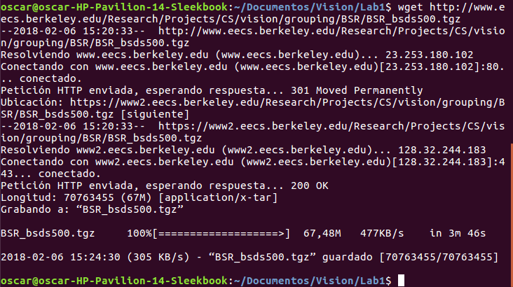

# Answers

1. **grep:** is a command, whose function is show as output the lines that match with a pattern. This find patterns in a specified file.

2. The line **#! /bin/bash** specifies where the translator or interpreter of commands is in the system. In this way, you can execute script as a common program, if the system presents the Bash installed in the Bin directory, can identify a script and how it work. 
    
3. In the course server exist 2 active users as show the capture, this is only in the server with IP 157.253.63.8
    


4. The command that produce a table of Users and Shells sorted by shell is ``who | cut  -d ' ' -f 1,12 | sort | uniq``, the next capture show a example of table.


   
5. The next script finding duplicate images based on their hash. The hash represents in a compact form a file or data set. For this reason, each image has its own hash.

	```
      	#!/bin/bash
	md5sum *| sort |uniq -w33 -D
      	```
With this script, was observed that the images 6.2.16.tiff and 6.2.32.tiff of folder **sequences** were the same, in the others folders don't exist repeated images.

6. The next capture shows as Download the [*bsds500*](https://www2.eecs.berkeley.edu/Research/Projects/CS/vision/grouping/resources.html#bsds500) image segmentation database using the terminal.




On the other hand, decompress it using the terminal.


 
7. The disk size of the uncompressed dataset BSR is 73571146 bytes, this size was achieved by using the command: du -bs. Moreover, in the directory 'BSR/BSDS500/data/images'had 500 images divided in three folders.
 
8. First, the resolution of the images is 481 x 321 or 321 x 481 with a total of 154K number of pixels. Second, the format of all images is JPG. This information was acquired with the command: identify -verbose "*.jpg" and looking directly at the folder containing the images.

9. The database has 152 images in *landscape* orientation, this is information this information is obtained through the command find . -name "*.jpg" -exec identify {} \; | grep -i 321x481 | wc -l, this is the similar as the command in the lab guide, only changed the search parameter and the image format.

 
10. All images was coverted them square (256x256) with the command mogrify -resize 256x256! *.jpg
